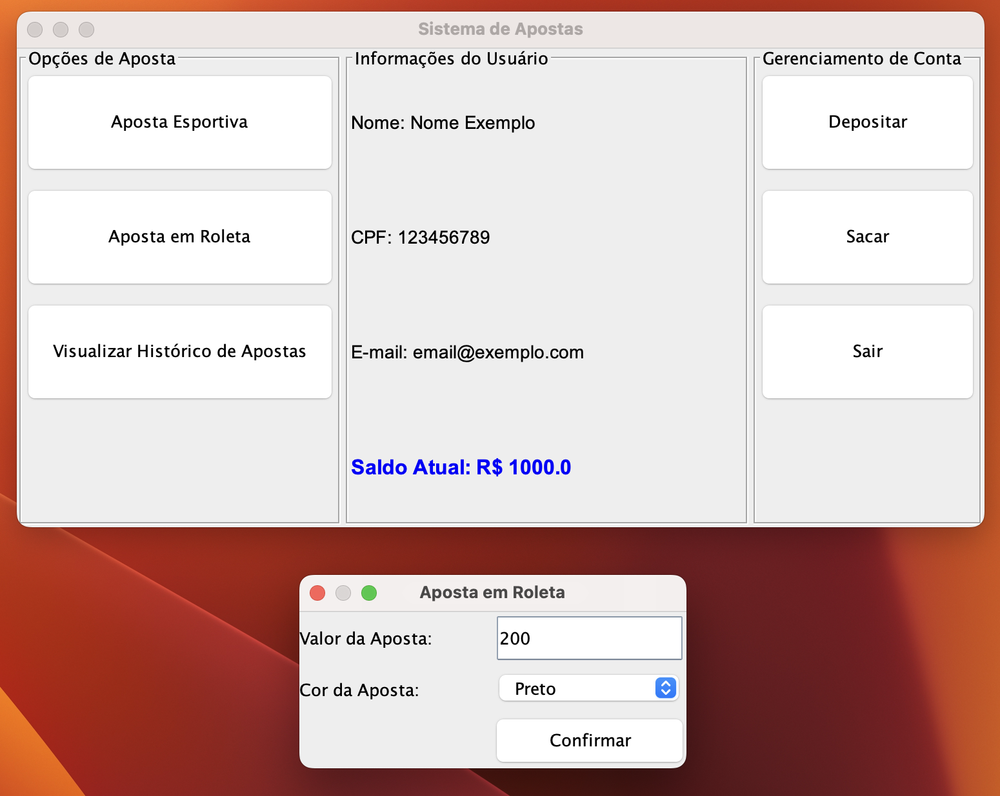
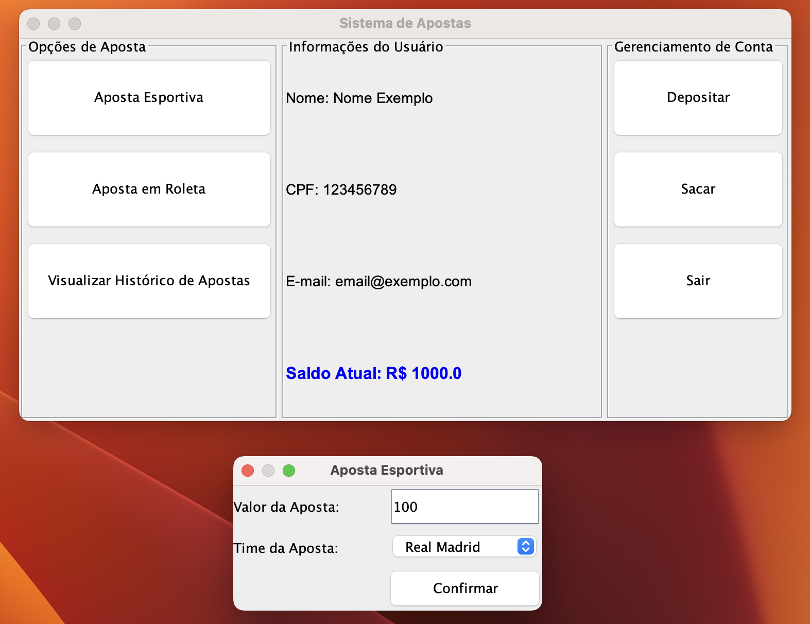

# GasosaBet

GasosaBet é um projeto de software de uma casa de apostas online que oferece aos usuários a oportunidade de participar de jogos de cassino e apostas esportivas. O projeto é implementado na linguagem Java com uma abordagem de programação orientada a objetos.

## Índice

- [Descrição](#descrição)
- [Funcionalidades](#funcionalidades)
- [Pré-requisitos](#pré-requisitos)
- [Instalação](#instalação)
- [Uso](#uso)
- [Exemplos de Uso](#exemplos-de-uso)
- [Estrutura do Projeto](#estrutura-do-projeto)
- [Contribuição](#contribuição)
- [Autores](#autores)

## Descrição

Este projeto foi desenvolvido como parte da disciplina de Programação Orientada a Objetos do 3º período de Engenharia de Software. O sistema permite que os usuários realizem apostas em jogos de roleta e em partidas esportivas, além de gerenciar seus saldos com funcionalidades de depósito e saque.

## Funcionalidades

- **Apostas em Cassino (Roleta):** Aposte em cores (preto, vermelho ou branco) na roleta e tenha a chance de dobrar ou até multiplicar por 14 o valor apostado.
- **Apostas Esportivas:** Aposte na vitória de times como Real Madrid ou Barcelona com odds específicas.
- **Histórico de Apostas:** Visualize o histórico de todas as apostas realizadas.
- **Depósitos e Saques:** Gerencie seu saldo realizando depósitos e saques.

## Pré-requisitos

- Java Development Kit (JDK) 8 ou superior
- IDE de sua escolha (Eclipse, IntelliJ IDEA, NetBeans, etc.)
- Git (para clonar o repositório)

## Instalação

1. **Clone o repositório:**
    ```bash
    git clone https://github.com/seu-usuario/gasosabet.git
    cd gasosabet
    ```

2. **Abra o projeto na sua IDE:**
   - Se estiver usando o Eclipse:
     - File > Import > Existing Projects into Workspace > Select root directory > Browse > Selecione a pasta do projeto clonado.
   - Se estiver usando o IntelliJ IDEA:
     - File > Open > Selecione a pasta do projeto clonado.

3. **Configure a execução do projeto:**
   - Certifique-se de que sua IDE está configurada para usar o JDK apropriado.

## Uso

1. **Execute a classe `MainGUI`:**
   - Essa classe contém o ponto de entrada do programa e abrirá a interface gráfica para interação.

2. **Navegação na interface:**
   - Use os botões da interface para realizar apostas, visualizar o histórico, realizar depósitos e saques.

## Exemplos de Uso

### Apostar em Roleta

1. Clique em "Aposta em Roleta".
2. Insira o valor da aposta e selecione a cor (Preto, Vermelho, Branco).
3. Clique em "Confirmar" e veja o resultado.



### Apostar em Esportes

1. Clique em "Aposta Esportiva".
2. Insira o valor da aposta e selecione o time (Real Madrid, Barcelona).
3. Clique em "Confirmar" e veja o resultado.



## Estrutura do Projeto

```
gasosabet/
│
├── src/
│   ├── Aposta.java
│   ├── ApostaEsportiva.java
│   ├── ApostaEsportivaDiag.java
│   ├── ApostaRoleta.java
│   ├── ApostaRoletaDiag.java
│   ├── Deposito.java
│   ├── MainGUI.java
│   ├── Saque.java
│   └── Usuario.java
│
├── README.md
└── historico_apostas.txt
```

- **Aposta.java:** Classe abstrata que define a estrutura básica de uma aposta.
- **ApostaEsportiva.java:** Implementa uma aposta esportiva, herda de `Aposta`.
- **ApostaEsportivaDiag.java:** Interface gráfica para realizar apostas esportivas.
- **ApostaRoleta.java:** Implementa uma aposta em roleta, herda de `Aposta`.
- **ApostaRoletaDiag.java:** Interface gráfica para realizar apostas em roleta.
- **Deposito.java:** Classe para gerenciar depósitos.
- **MainGUI.java:** Interface gráfica principal do sistema.
- **Saque.java:** Classe para gerenciar saques.
- **Usuario.java:** Classe que representa um usuário do sistema.

## Contribuição

Contribuições são bem-vindas! Sinta-se à vontade para abrir issues e enviar pull requests.

1. **Fork o projeto:**
    ```bash
    git fork https://github.com/seu-usuario/gasosabet.git
    ```

2. **Crie uma branch para sua feature:**
    ```bash
    git checkout -b minha-feature
    ```

3. **Faça commit de suas alterações:**
    ```bash
    git commit -m "Adiciona minha feature"
    ```

4. **Envie para o repositório remoto:**
    ```bash
    git push origin minha-feature
    ```

5. **Abra um pull request no GitHub.**

## Autores

- **Eduardo Bonacin**
- **Erick Menezes**
- **Emerson Boiani**
- **Flávio Cordeiro**
